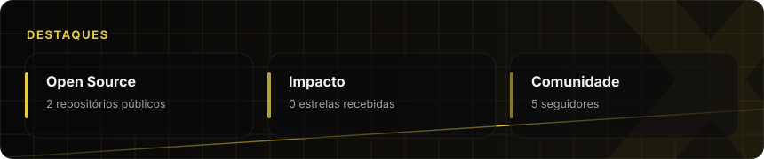
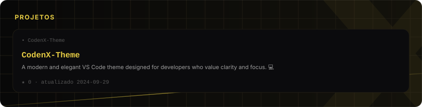
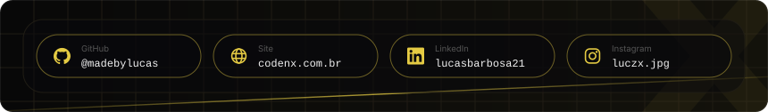

  

## Sobre

Sou fundador da **CodenX**, agência digital focada em desenvolvimento web, e-commerce, marketing digital e UI/UX. Antes de liderar equipe, comecei escrevendo código — e ainda coloco a mão nele todos os dias.

Gosto de construir do início ao fim: da arquitetura técnica ao produto que o cliente final usa. Também sou apaixonado por game design e worldbuilding, e mantenho um projeto pessoal de jogo nas horas vagas.

- 🏢 **CodenX** — [codenx.com.br](https://codenx.com.br)
- 💻 Interfaces com atenção a performance, animação e detalhes
- 🎮 Worldbuilding e game design como projeto paralelo
- 📍 Monte Azul Paulista · SP, Brasil

  

## Atividade

  

## 📊 Git Analysis

  
  

  

## Projetos

  

## Contato

  

  

Cards gerados por <a href="scripts/build_cards.py">scripts/build_cards.py</a>; cobrinha por <a href="https://github.com/Platane/snk">Platane/snk</a>. Atualizados diariamente por GitHub Actions.
